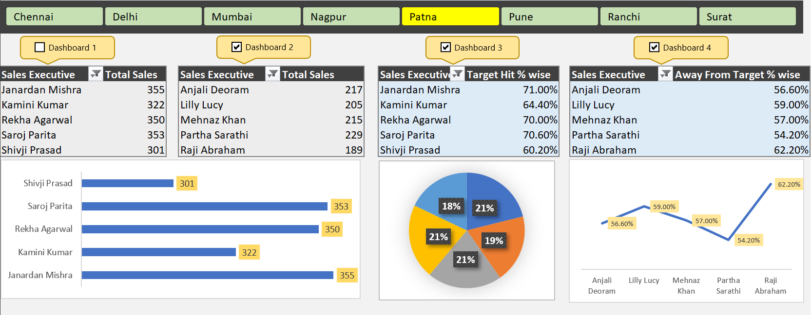

# 📊 Sales Performance Dashboard (Excel Automation Project)
  
**Tools Used:** Microsoft Excel (Pivot Tables, Charts, Macros, Data Validation, Conditional Formatting)

---

## 📘 Project Overview
This project focuses on designing an **interactive, automated Sales Performance Dashboard** in Excel to monitor and analyze **regional sales KPIs** such as *Total Sales*, *Target Hit %*, and *Away from Target %*.  

The dashboard provides a one-click interface to compare sales performance across multiple cities, identify top-performing executives, and visualize deviations from targets.

---

## 🎯 Objective
To automate and visualize multi-regional sales data, enabling management to:
- Track performance of 140+ sales executives across 7 regions.
- Monitor real-time KPIs like Target Achievement and Missed Target %.
- Quickly identify top and low performers for decision-making.

---

## 🧾 Dataset Description
The dataset contains **sales records** of executives from **seven regions** — Chennai, Delhi, Mumbai, Nagpur, Patna, Pune, Ranchi, and Surat.

| Column | Description |
|---------|--------------|
| Emp Code | Unique employee code |
| Sales Executive | Name of sales representative |
| Region | Location/region |
| Day 1–Day 5 | Daily sales data (in units) |
| Total Sales | 5-day cumulative sales |
| Target | Assigned sales target |
| Target Hit % | (Total Sales / Target) × 100 |
| Away From Target % | 100 – Target Hit % |

---

## ⚙️ Methodology

### 🔹 Data Cleaning & Preparation
- Organized raw sales data of 140+ executives using Excel filters and data validation tools.  
- Standardized regional names, corrected missing entries, and verified numeric consistency.  
- Created calculated fields for:
  - **Target Hit %** = (Total Sales ÷ Target) × 100  
  - **Away From Target %** = 100 – Target Hit %

### 🔹 Dashboard Design
- Built a **multi-region dashboard** with tab-based navigation for each city.  
- Designed **interactive KPIs** using Pivot Tables and Pivot Charts.  
- Implemented **dynamic slicers and filters** to explore data by region or executive.

### 🔹 Automation & Visualization
- Automated KPI updates using **VBA Macros** to refresh Pivot Tables and charts.  
- Used **Conditional Formatting** to highlight top and bottom performers.  
- Created **bar, pie, and line charts** for different KPIs.

---

## 📈 Dashboard Highlights

### Key Features:
- 🏙️ Region-level navigation for Chennai, Delhi, Mumbai, Nagpur, Patna, Pune, Ranchi, and Surat.  
- 📊 KPIs: Total Sales, Target Hit %, Away from Target %.  
- 📈 Automated performance trends for top and bottom sales executives.  
- 🎨 Dynamic visuals (bar, pie, and line charts) for target achievement and variance.  
- ⚡ Macro-enabled automation for real-time updates.

---

## 🔍 Insights & Findings

| Region | Top Performer | Target Hit % | Lowest Performer | Away from Target % |
|---------|----------------|---------------|------------------|--------------------|
| Patna | Janardan Mishra | 71.0% | Raji Abraham | 62.2% |
| Mumbai | Raj Verma | 67.8% | Swarnlata Borse | 62.2% |
| Chennai | Surendra Kumar | 75.2% | Salim | 57.2% |
| Nagpur | Arvind Sharma | 75.8% | Renu Pratap | 58.8% |

### 📊 Key Observations:
- **Nagpur and Patna** had the **highest performance averages**.  
- **Surat and Delhi** had the most executives below 60% target.  
- Performance varied sharply across cities, indicating potential for **region-specific training and incentives**.

---

## 🚀 Impact
- Automated manual reporting using Excel macros — saving **60% reporting time**.  
- Improved visibility into regional performance metrics.  
- Enabled management to identify **underperforming regions and top achievers** easily.  

---

## 🧠 Learnings
- Advanced Excel data management and automation using **VBA Macros**.  
- Dashboard design with **interactive Pivot Charts and dynamic filters**.  
- KPI computation and conditional formatting for data-driven reporting.  
- Enhanced understanding of **business performance tracking and visualization**.

---

## 📂 Project Structure
